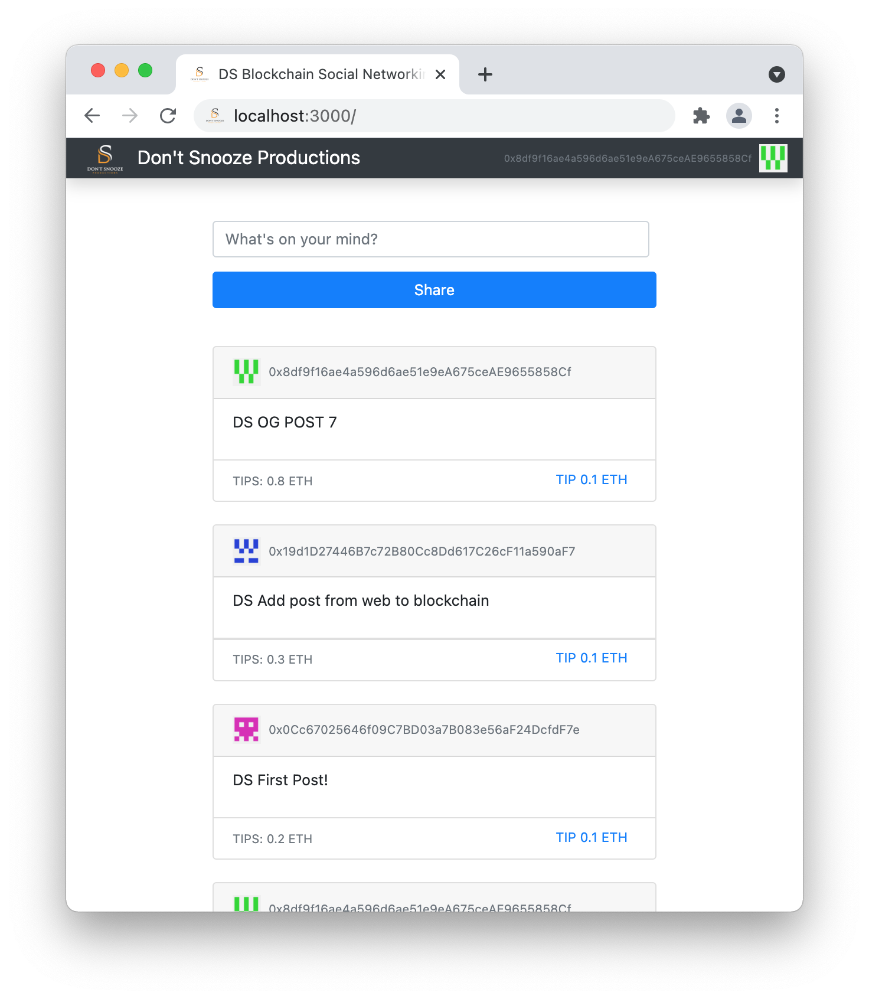

# DS Blockchain Social Networking

This is a Social networking app that runs off a smart contract on the ethereum blockchain.

Users can post messages and tip posts. Tips go to the post author.

There is no database or backend server to save data. All message/tips data is stored on the blockchain.

Currently using a personal blockchain from [Ganache](https://www.trufflesuite.com/ganache) for test purposes. 

Frontend tested and working on Chrome using MetaMask:

Thanks to [dappuniversity.com](https://www.dappuniversity.com) for tutorials.
