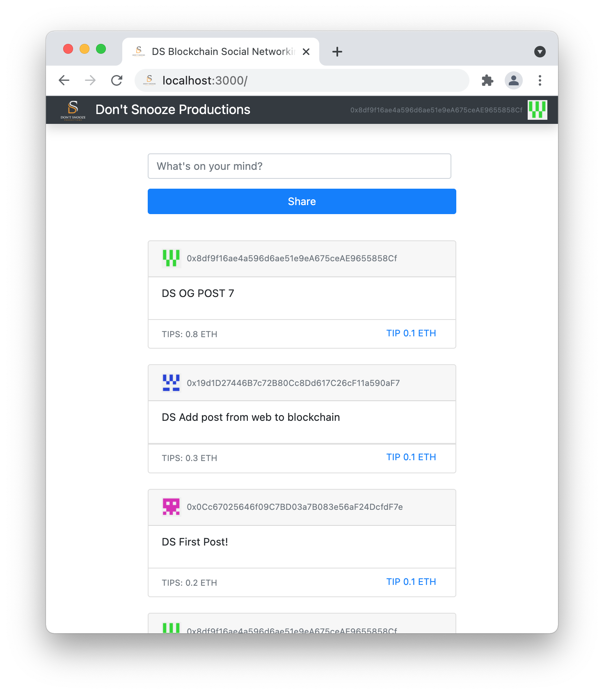

# DS Blockchain Social Networking

This is a Social networking app that runs off a smart contract on the ethereum blockchain.

Users can post messages and tip posts. Tips go to the post author. Posts are sorted from highest to lowest tip amount.

There is no database or backend server to save data. All message/tips data is stored on the blockchain.

Currently using a personal blockchain from [Ganache](https://www.trufflesuite.com/ganache) for test purposes. 

Frontend tested and working on Chrome using MetaMask:

Dependencies:

[Node](https://nodejs.org)
- `brew install node`

[Ganache](https://www.trufflesuite.com/ganache)
- Personal Ethereum blockchain (mainly used for test purposes)
- Tip: Use the quick start option once installed

[Truffle Framework](https://www.trufflesuite.com/truffle)
- Tools for developing blockchain applications. 
- Develop smart contracts, write tests against them, and deploy them to the blockchain.
- `npm install -g truffle@5.0.5`

[MetaMask](https://metamask.io)
- Chrome plugin
- Gateway to blockchain apps and also a crypto wallet

To start the frontend web server:
- In the project root directory install any dependencies from package.json
    - `npm install`
- Start the server
    - `npm run start`

Thanks to [dappuniversity.com](https://www.dappuniversity.com) for tutorials.
